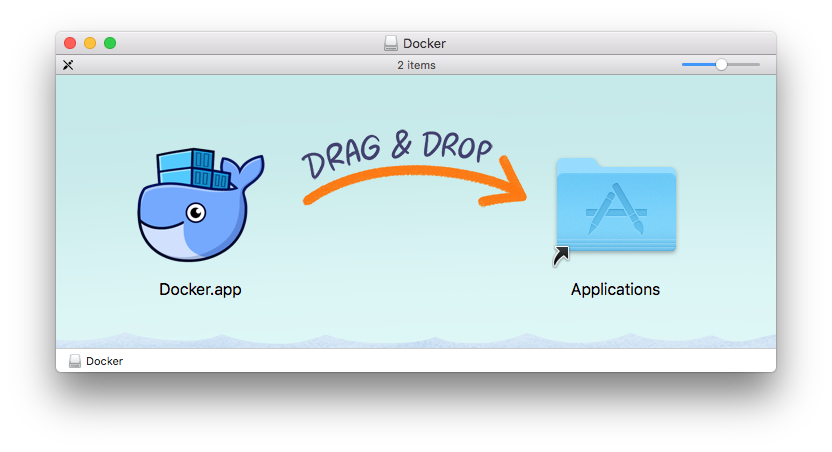
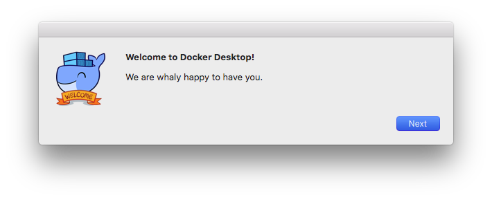
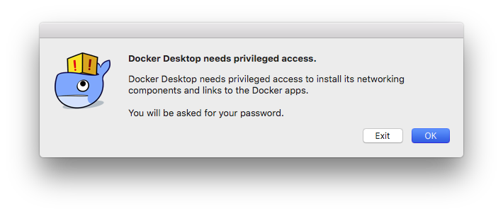
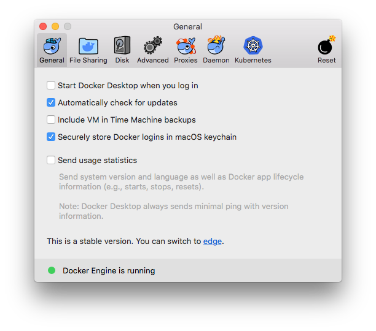
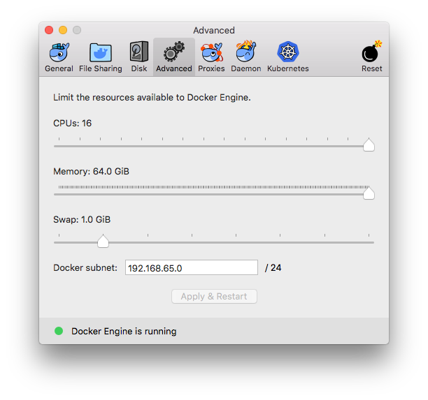

Setting up Docker for macOS
============================

Docker is available to users of macOS as a standalone app from [docker.com](https://www.docker.com).

<!-- markdown-toc start -->
**Table of Contents**

- [Downloading Docker for Mac](#downloading-docker-for-mac)
- [Installation](#installation)
  - [Warning about incompatible apps](#warning-about-incompatible-apps)
- [Additional Configuration](#additional-configuration)
  - [Run at startup](#run-at-startup)
  - [CPU and Memory Limits](#cpu-and-memory-limits)
- [Proceed to Gitian Setup for Mac](#proceed-to-gitian-setup-for-mac)

Downloading Docker for Mac
---------------------------

You can download Docker for Mac directly from [docker.com](https://www.docker.com) by registering for a free account. Alternatively, you can use [this direct link](https://download.docker.com/mac/stable/Docker.dmg) to download the same `.dmg` installer.

Installation
-------------

Once you've downloaded the `Docker.dmg` file, double click on it. A few finder window will come up with instructions for installing.

Like most apps for macOS, installation is a simple process of dragging the App (`Docker.app` in this case) over to the provided `Applications` folder.

Once the app has finished copying to your Applications folder, close the window above and launch Docker from either Launchpad or from your Applications folder.

##### Warning about incompatible apps

Some 3rd party applications, such as BlueStacks (an android emulator) can interfere with Docker. If you have any such applications installed, Docker will present you with a warning message like the one below.

It is safe to keep such programs installed, but you'll need to be sure to not run Docker after having used the incompatible app without first rebooting your computer.

##### Initial Setup

The first time Docker is opened, it will need to do some initial setup tasks, which it will guide you thorough. Simply follow the on-screen instructions:

As mentioned, you will be asked for your password to complete the initial setup. Once you've provided your password, Docker will be running and a new Docker icon will appear in the menu bar at the top of your screen.

Additional Configuration
-------------------------

Now that Docker is installed and running, there are just a couple more additional configuration steps needed before moving on.

Click on the docker icon in the menu bar at the top of your screen and select "Preferences..." to open the Docker configuration window.

##### Run at Startup

By default, Docker is configured to run automatically whenever you log in to your computer. You can choose to disable this, as I have in the image below.

##### CPU and Memory Limits

The last thing to configure is the CPU and Memory limits for Docker. Click on the "Advanced" icon and use the sliders to set higher values. In the image below, I just moved them all the way to the right, which allows Docker to utilize the full resources of my computer.

You should allow at least 4 CPUs and 4 GiB of Memory in order to not have problems with Gitian building.

Proceed to Gitian Setup for Mac
--------------------------------

Docker is now installed, configured, and ready to be used. Proceed to the [Gitian Setup for Mac](./gitian-setup-mac.md) guide.