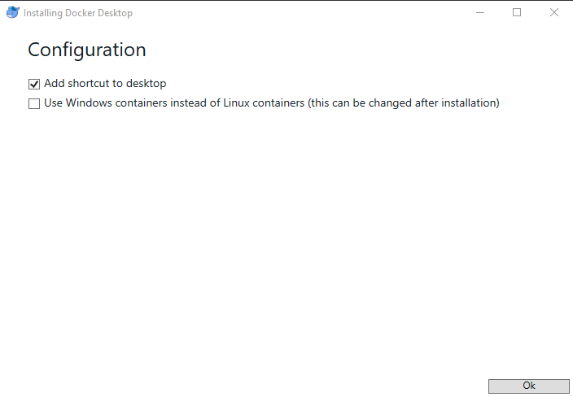
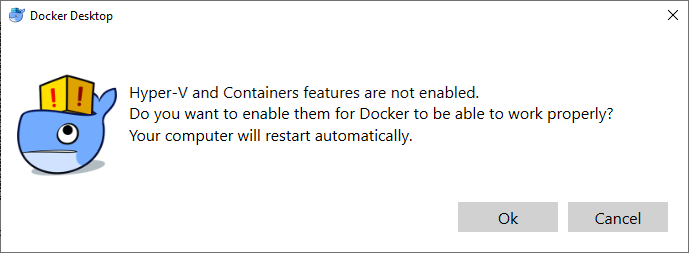
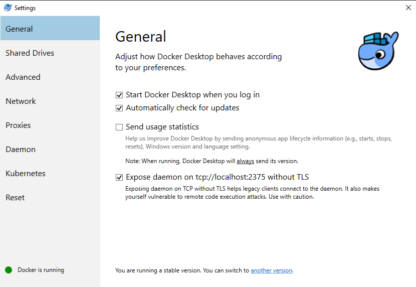
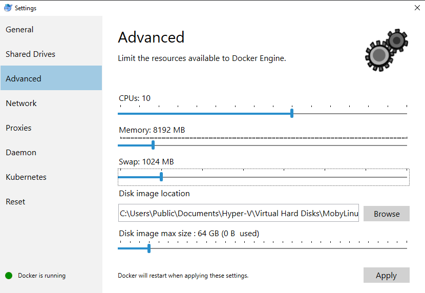

Setting up Docker for Windows
==============================

In this guide, we use Docker for Windows, which is required due to a compatibility issue with the Docker daemon running natively in WSL.

Installation and setup of Docker for Windows itself is fairly straight forward, but there are a couple considerations of note below.

<!-- markdown-toc start -->
**Table of Contents**

- [Downloading Docker for Windows](#downloading-docker-for-windows)
- [Installing Docker for Windows](#installing-docker-for-windows)
    - [Enable Hyper-V](#enable-hyper-v)
- [Additional Configuration](#additional-configuration)
    - [Expose the Docker service to local TCP requests](#expose-the-docker-service-to-local-tcp-requests)
    - [Set the CPU/RAM Limits](#set-the-cpuram-limits)
- [Proceed to WSL Installation](#proceed-to-wsl-installation)

<!-- markdown-toc end -->

Downloading Docker for Windows
-------------------------------

First things first, head over to [www.docker.com](https://www.docker.com) and download Docker Desktop for Windows. This requires registering for a free account, or you can download the latest stable release directly [Here](https://download.docker.com/win/stable/Docker%20for%20Windows%20Installer.exe).

Installing Docker for Windows
-------------------------------

Once your download has finished, simply run the installer program and follow the on-screen prompts.

Make sure the checkbox to use windows containers is **UNCKECKED**:

Once installation is complete, you will be prompted to log out of Windows:

##### Enable Hyper-V

Docker for Windows relies on Hyper-V technology, and will prompt you to enable Hyper-V if it isn't already enabled.

*Note: Enabling Windows Hyper-V will prevent the use of some 3rd party virtualization apps such as Android Studio*

Additional Configuration
-------------------------------

After logging out and back into Windows (or restarting), there are only a couple more steps needed in order to have Docker ready for use with Gitian. Both are done in the Docker for Windows Settings UI.

You can access the Settings UI by right-clicking on the Docker dock icon and selecting "Settings" from the menu.

##### Expose the Docker service to local TCP requests

This step is required in order to allow the docker cli program from WSL to run containers and commands using the Docker for Windows service.

On the General tab, check the box next to "Expose daemon on..."

*Note: the warning here can be ignored with proper firewall settings*

##### Set the CPU/RAM Limits

The default settings for the number of CPUs and Memory can work, but if your system has more resources to spare then it would speed up the gitian build process to allocate more resources.

Below are examples that will need to be adjusted to suit your specific machine, but the minimums would be 2 CPUs and 4GB Memory. Swap size and disk image max size defaults are fine.

Proceed to WSL Installation
-------------------------------

Thats all you need to do for Docker for Windows installation and configuration.

Proceed to [WSL Installation](./wsl-setup-windows.md) for instructions on Installing and configuring WSL.