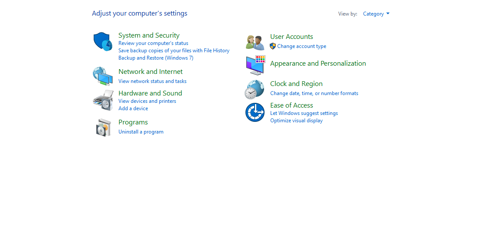
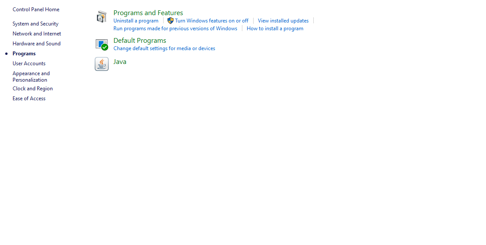
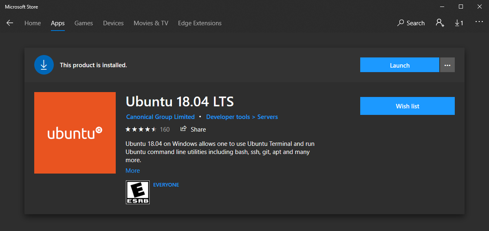
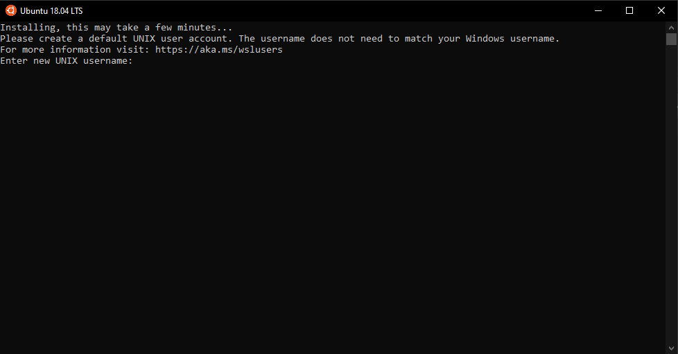
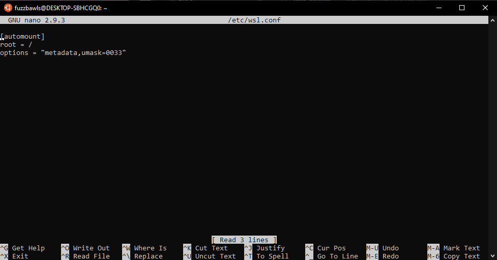

Setting Up WSL
=====================

Windows 10 introduced a new feature called Windows Subsystem for Linux (WSL), which allows the installation of various linux distributions directly in Windows. This feature has mostly removed the need to use virtual machine setups.

<!-- markdown-toc start -->
**Table of Contents**

- [Preparing to install Windows Subsystem for Linux](#preparing-to-install-windows-subsystem-for-linux)
- [Installing WSL from the Microsoft Store](#installing-wsl-from-the-microsoft-store)
- [Initial Setup of WSL](#initial-setup-of-wsl)
- [Proceed to Gitian Setup for Windows](#proceed-to-gitian-setup-for-windows)

<!-- markdown-toc end -->

Preparing to install Windows Subsystem for Linux
-------------------------------------------------

To install WSL, you first need to enable the Windows Subsystem for Linux extra feature.

First, open up the Windows Control panel and click on Programs:

Then, click on "Turn Windows features on or off":

In the new window, scroll down and check the box next to "Windows Subsystem for Linux":

Click "OK" and reboot if necessary.

Installing WSL From the Microsoft Store
----------------------------------------

Once your system has been configured to support WSL, Installation is just a matter of opening up the Microsoft Store app and searching for "Ubuntu".

There may be more than one result, but the one we use is "Ubuntu 18.04 LTS". Click on it's preview icon, then click "Install"

Once installed, you can click "Launch" from the Microsoft Store, or use the new Start menu item.

Initial Setup of WSL
---------------------

The first time you launch Ubuntu 18.04 LTS, you will be asked to setup a username and password. These are separate from your Windows username and password:

After initial setup and user creation, make sure the system is up to date by running the following commands:

    sudo apt update
    sudo apt upgrade

*Note: whenever you run a command that starts with `sudo`, it is instructing the system to run the following commands with elevated privileges. You may be asked for your linux account's password.*

We then need to set the `DOCKER_HOST` environment variable and fix the `PATH` environment variable to strip out unwanted windows paths. Run the following commands:

    echo "export DOCKER_HOST=tcp://localhost:2375" >> ~/.bashrc
    echo "PATH=$(echo "$PATH" | sed -e 's/:\/mnt.*//g')" >> ~/.bashrc
    source ~/.bashrc

Next, edit the `/etc/wsl.conf` file to fix the Windows mount points to work with Docker. Run the following command:

    sudo nano /etc/wsl.conf

This will bring up the nano text editor, copy and paste the below (default paste action in a WSL window is right click).

    [automount]
    root = /
    options = "metadata"

Your screen should now look similar to this image:

Save (`ctrl+x`) the file, confirm you want to write to `/etc/wsl.conf` (press enter), then reboot your computer for the changes to take effect.

Proceed to Gitian Setup for Windows
------------------------------------

WSL is now prepared for use with Gitian, proceed to [Setup Gitian on Windows](./gitian-setup-windows.md).